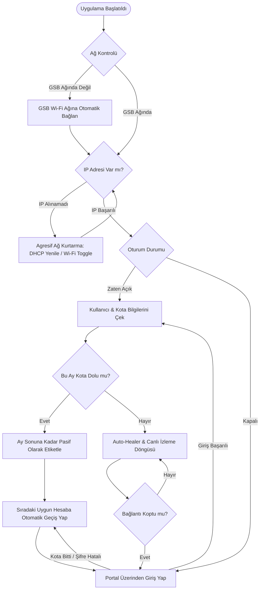

<p align="center">
  <h1 align="center">✨ GSB Wi-Fi Manager</h1>
  <p align="center">
    <strong>KYK & GSB Yurt Ağları İçin Akıllı, Kesintisiz ve Çok Hesaplı Wi-Fi Yöneticisi</strong>
    <br />
    Portal girişlerini otomatikleştirin, kota sınırlarını aşın, kopmalara son verin.
    <br />
    <br />
    <a href="https://github.com/ugurboz/GSB-Wifi-Manager/releases"><strong>Son Sürümü İndir »</strong></a>
    ·
    <a href="https://github.com/ugurboz/GSB-Wifi-Manager/issues">Hata Bildir</a>
    ·
    <a href="https://github.com/ugurboz/GSB-Wifi-Manager/issues">Özellik Öner</a>
  </p>
</p>

<p align="center">
  <a href="https://www.python.org/downloads/"></a>
  <a href="https://opensource.org/licenses/MIT"></a>
  <a href="https://github.com/ugurboz/GSB-Wifi-Manager/releases"></a>
  <a href="https://github.com/ugurboz/GSB-Wifi-Manager/pulls"></a>
</p>

---

## 📌 Nedir?

**GSB Wi-Fi Manager**, Türkiye genelindeki **KYK / Gençlik ve Spor Bakanlığı** yurtlarında kullanılan **GSBWIFI** ağına bağlanma, kota takip etme ve oturum sürdürme süreçlerini otonom hale getiren modern bir masaüstü ve terminal aracıdır.

Her gün tarayıcıdan portala TC ve şifre girmek, yurt ağındaki yoğunluktan IP alamamak, internetin aniden kopması veya kotanız bittiğinde internetsiz kalmak gibi sorunları tamamen ortadan kaldırır.

---

## ✨ Öne Çıkan Özellikler

| Özellik | Açıklama |
| :--- | :--- |
| **🔄 Auto-Healer (Kesintisiz Bağlantı)** | Ağ kopmalarını ve portal oturum düşüşlerini arka planda periyodik kontrol eder. Bağlantı koptuğu anda saniyeler içinde otomatik olarak tekrar bağlanır. |
| **📅 Aylık Akıllı Kota Yönetimi** | Kotası tükenen hesaplar otomatik olarak etiketlenir ve ay sonuna kadar geçişlerde atlanır. **Her ayın 1'inde kotalar otomatik olarak sıfırlanır ve açılır.** |
| **🔀 Kesintisiz Auto-Switch** | Aktif hesabın kotası bittiğinde, şifresi yanlış olduğunda veya hesap silindiğinde sistem otomatik olarak sıradaki sağlıklı hesaba geçiş yapar. |
| **👥 Çoklu Hesap & Otomatik İsim Çekme** | Sınırsız sayıda hesap ekleyin. Portala ilk girişte öğrencinin gerçek ad-soyad bilgisi portaldan otomatik çekilir ve profil adı olarak atanır. |
| **📱 Maksimum Cihaz Yönetimi** | Portalda oluşan *"Maksimum cihaz hakkı dolu"* kilitlenmelerinde önceki askıda kalmış oturumları otomatik sonlandırarak yeni girişi sağlar. |
| **🌐 Agresif Ağ Kurtarma** | Yurt ağındaki yoğunluktan dolayı IP alınamadığında veya portal yanıt vermediğinde DHCP yenileme ve Wi-Fi döngüsü ile bağlantıyı kurtarır. |
| **🔒 Yerel Güvenli Şifreleme** | Şifreler cihazınızda AES-256 (Fernet) ile şifrelenerek saklanır. Hiçbir veri üçüncü taraf sunuculara iletilmez, yalnızca resmi GSB portalı ile iletişim kurulur. |
| **🖥️ Çift Arayüz (GUI & CLI)** | İster modern macOS tarzı CustomTkinter masaüstü uygulamasını, ister gelişmiş terminal arayüzünü kullanın. |

---

## 🖥️ Arayüz ve Kullanım Modları

### 1. Modern Masaüstü Arayüzü (GUI)
macOS tasarım diline uygun, karanlık ve aydınlık mod destekli şık masaüstü paneli:
* **Canlı Kota Barları:** Sosyal Medya ve Toplam kotaları görsel ilerleme çubuklarıyla anlık takip edin.
* **Hesap Kartları:** Hesaplar arasında tek tıkla geçiş yapın, yeni profiller ekleyin veya silin.
* **Akıllı Çıkış Seçenekleri:** Sol alttaki **Çık** butonuyla interneti açık bırakarak uygulamayı kapatabilir veya **Oturumu Kapat** ile portal oturumunu güvenle sonlandırabilirsiniz.

### 2. Gelişmiş Terminal Arayüzü (CLI)
Sunucularda, arka plan oturumlarında veya terminal tutkunları için zengin CLI deneyimi:
* **Canlı Bağlantı İzleme:** Oturum durumunu arka planda izler, kopmaları anında onarır.
* **İnteraktif Menü (`[1] + Enter`):** Canlı izlemeyi kesmeden profilleri listeleyin, değiştirin, yeni hesap ekleyin veya silin.
* **Akıllı Kısayollar:**
  * `Ctrl + C` : Uygulamadan çıkar (**İnternet AÇIK kalır**).
  * `Ctrl + Z` : Oturumu güvenle kapatır ve çıkar (**İnternet KESİLİR**).

---

## 🚀 Kurulum

### Yöntem 1: Kaynak Koddan Çalıştırma (Tavsiye Edilen)

```bash
# Repoyu klonlayın
git clone https://github.com/ugurboz/GSB-Wifi-Manager.git
cd GSB-Wifi-Manager

# Gerekli bağımlılıkları yükleyin
pip install -r requirements.txt
```

#### Masaüstü Uygulamasını (GUI) Başlatma:
```bash
python3 gsb_app.py
```

#### Terminal Modunu (CLI) Başlatma:
```bash
python3 gsb_login.py
```

---

### Yöntem 2: Global CLI Kurulumu (`pip install -e .`)

Projeyi sisteminize geliştirici modunda kaydederek terminalden doğrudan `gsb` komutunu kullanabilirsiniz:

```bash
pip install -e .
```

Kurulum tamamlandıktan sonra:
* `gsb` : Masaüstü grafik arayüzünü (GUI) açar.
* `gsb-cli` : Terminal bağlantı ve izleme modunu başlatır.

---

## ⌨️ CLI Komut Satırı Parametreleri

`gsb-cli` komutunu parametrelerle kullanarak hesapları kolayca yönetebilirsiniz:

| Komut | Açıklama |
| :--- | :--- |
| `gsb-cli` | Aktif hesapla otomatik bağlanır ve canlı izleme modunu başlatır. |
| `gsb-cli --list-accounts` | Kayıtlı tüm profilleri, aktif hesabı ve kota durumlarını listeler. |
| `gsb-cli --switch-account [idx]` | Belirtilen indeks numaralı hesaba geçiş yapar (Parametresiz girilirse seçim listesi sunar). |
| `gsb-cli --add-account` | Terminalden yeni bir TC ve şifre ekler veya mevcut hesabı günceller. |
| `gsb-cli --remove-account [tc/idx]` | Belirtilen hesabı siler (TC veya indeks numarası girilebilir). |
| `gsb-cli --logout` | Açık olan GSB portal oturumunu kapatır ve internet bağlantısını keser. |
| `gsb-cli --reset` | Cihazda kayıtlı tüm hesap bilgilerini sıfırlar. |
| `gsb-cli --no-keep` | Giriş yaptıktan sonra arka planda izleme yapmaz, 60 saniye sonra oturumu kapatır. |

---

## 🔄 Mimari ve Çalışma Mantığı



---

## 🔒 Güvenlik ve Gizlilik

1. **Yerel Saklama:** Tüm kullanıcı verileri ve hesap listesi yalnızca kullanıcının yerel cihazındaki güvenli dizinde (`~/.gsb_wifi/`) saklanır. Proje klasöründe tutulmaz, Git reposuna dahil edilmez ve paket güncellemelerinde kaybolmaz.
2. **Kriptografik Koruma:** Şifreler düz metin olarak değil, `cryptography` modülü kullanılarak güçlü AES tabanlı Fernet şifreleme algoritmasıyla korunur.
3. **Sıfır Telemetri:** Uygulama hiçbir analitik, telemetri veya harici sunucuya veri aktarımı yapmaz; ağ istekleri yalnızca resmi `wifi.gsb.gov.tr` portal adresine gönderilir.

---

## 🤝 Katkıda Bulunma

Projeye katkıda bulunmaktan çekinmeyin!
1. Bu depoyu çatallayın (**Fork**).
2. Yeni bir özellik dalı açın (`git checkout -b ozellik/harika-fikir`).
3. Değişikliklerinizi kaydedin (`git commit -m 'feat: Harika özellik eklendi'`).
4. Dalınızı uzak depoya gönderin (`git push origin ozellik/harika-fikir`).
5. Bir **Pull Request (PR)** oluşturun.

---

## 📝 Lisans

Bu proje [MIT Lisansı](LICENSE) kapsamında lisanslanmıştır. Özgürce kullanılabilir, değiştirilebilir ve dağıtılabilir.
